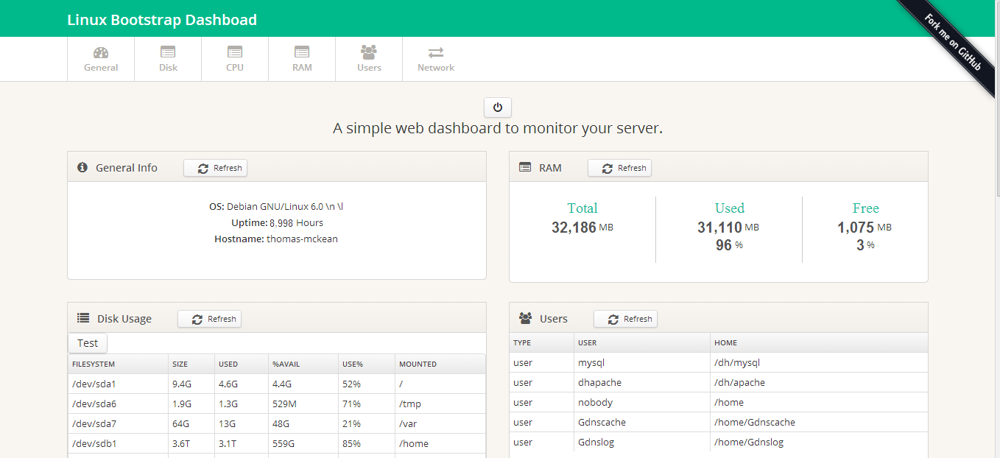

Linux-Dash-Flaskified 
====

This is Python/Flask redo of [Linux-Dash](https://github.com/afaqurk/linux-dash) from Github user [afaqurk](https://github.com/afaqurk)

The first run is a 1:1 copy of layout and whatnot just with Python replacing the PHP calls. 

Future plans are for auto-polling and some pretty visualizations

